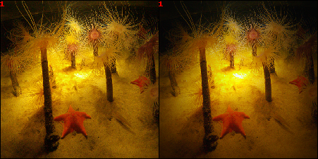

# Adversarial Attacks on Explainability Methods for Image Classification Models
A multi-objective evolutionary algorithm for crafting adversarial examples to test the faithfulness of various Explainability methods for Image Classification Models. <br>

## Introduction and Context
Deep neural networks have achieved remarkable performance across a wide range of tasks, with notable successes on image classification, speech recognition, and natural language processing. However, one significant challenge associated with these models is their perceived lack of interpretability, i.e the difficulty to understand how they arrive at their predictions. For this reason, we often refer to neural networks as "**black boxes**". This lack of transparency can be a significant issue, particularly in applications where the consequences of incorrect predictions can be severe, such as medical diagnosis or autonomous driving. <br>
To address this issue, researchers have developed various **explainability methods** to provide **insights** into the decision-making process of deep neural networks. These methods differ according to the type of application in which the models are used. For example, in the image classification task we can use methods such as saliency maps,
activation maximization, and perturbation-based approaches, which identify the image areas that contributed most to the prediction. While, in the case of tabular data, there are approaches able to identify the data or features that contributed most in the decision. Furthermore, for other tasks such as natural language processing, attention
mechanisms can provide insights into the words and phrases that heavily influence predictions.<br>
In this study, we focus on image classification models due to their prevalence and relevance in various domains. However, it’s important to note that the concept of **Explainable Artificial Intelligence (XAI)** extends beyond image classification and encompasses techniques that can provide insights into the decision-making processes of diverse machine learning models. <br>
Nevertheless, recent research has uncovered a potential vulnerability within these explainability methods, that is their susceptibility to **adversarial attacks**. In such attacks, an attacker manipulates an input image to cause the explainability methods producing incorrect or misleading explanations while preserving the visual appearance of the original image and the correct classification label by the model. This vulnerability poses a significant challenge in achieving reliable and trustworthy interpretability techniques.
Therefore, the purpose of this project is to investigate the utilization of adversarial machine learning to attack explainability methods employed in image classification models. Specifically, we aim to examine the impact of adversarial attacks on the interpretability of deep neural networks and compare the performance of different explainability methods in the presence of adversarial examples.

## About the Attack Algorithm
For any information about the algorithm and the attack specification see the `Thesis_report` pdf attached :open_file_folder: to this repo.

## Output examples
Below is an example of the result produced by our algorithm. In the first image we can see the original image and the modified image produced by our algorithm, while in the second and third we can see the explanations and the resulting heatmaps. <br>
The starfish (the primary class label in the classification model’s output) is initially correctly identified
by the explainability method. However, after applying a perturbation generated by our algorithm, which is imperceptible to the human eye, the resulting explanation becomes entirely different. This serves as a classic example of the type of attack we aim to achieve.

<center>




*Example of an effective adversarial attack that is difficult for the human eye to perceive.*

</center>


## Installation guide and How to run
Before running the code make sure to add the images for the adversarial attack in the folder: datasets/images_dataset/emo_images/selected_balanced_images_renamed. <br>
The images must be renamed using the following scheme: `class_id.image.id.jpg`.
For examples an image with original id = 842 belonging to the class 7 (representing the Surprise class) must be renamed to: `7.842.jpg` <br>
***For simplification, we have already inserted a dataset of 200 example images into the repo.***

The weights of the trained model can be found in the folder :open_file_folder:: `models/emo_weights`.

### 1. Install dependencies.
```sh
pip install -r requirements_cpu.txt
```
To run the code on GPU, install this list instead:
```sh
pip install -r requirements_gpu.txt
```

### 2. Example of how to run the code:
- To launch the attack:
```sh
python attacks_emotions/agv/agv_attack.py -l TEST.txt -o TEST.json -bs 1 -e 10 -pp  "offsprings" -ps "direct" -po "ES"  -np 10 -el true -s pareto -df1 ssim -db "IMAGENET-RESNET"  -nf 3 -r true -lf TEST.out
```

- To produce and see image result:
```sh
python attacks_emotions/agv/agv_attack.py -bf TEST/best_jsons -db "IMAGENET-RESNET" -sae_best=True -img_id 0
```
(the images will be saved on the `TEST` folder :open_file_folder:)

#### References
This project is based on the [AGV-Project](https://github.com/Ellyuca/AGV-Project) for crafting evolutionay adversarial attacks using Instagram inspired image filters.